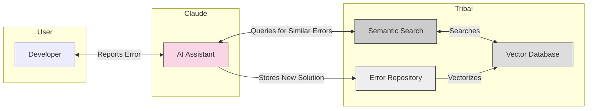
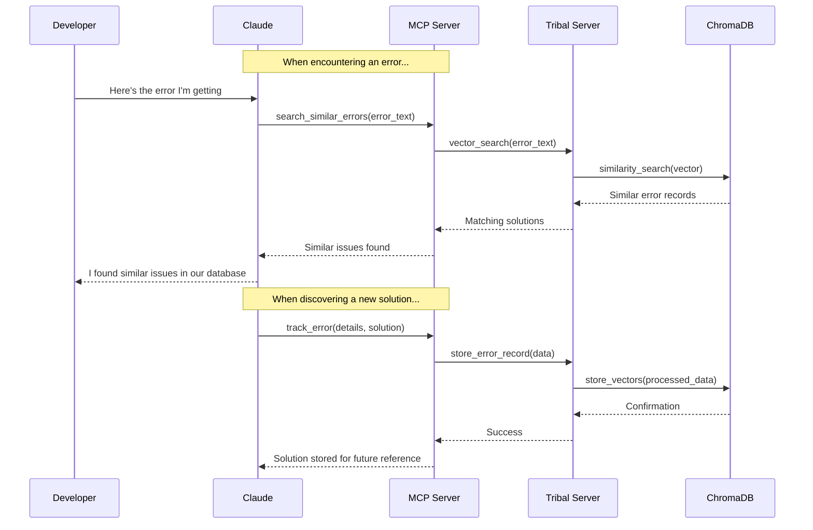
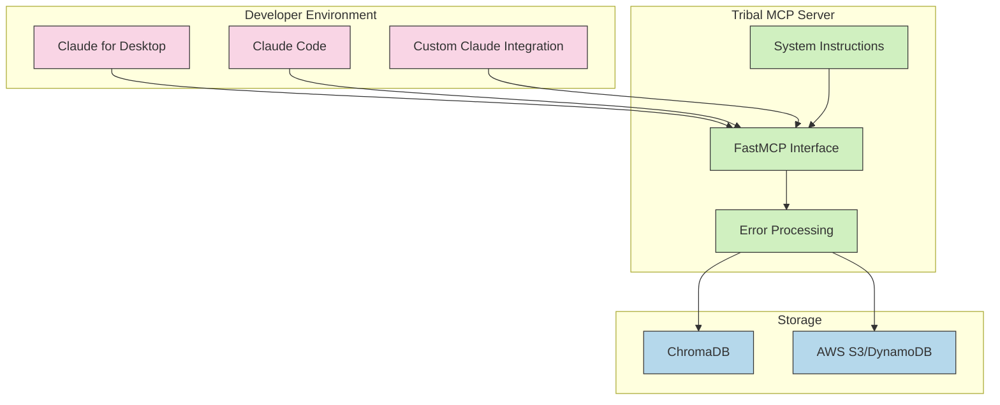
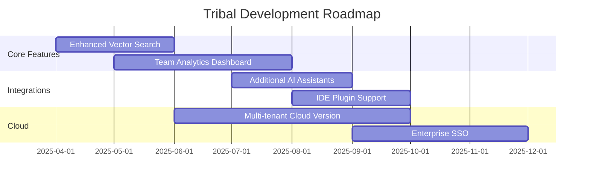

# Never Solve the Same Bug Twice: Introducing Tribal for Claude

## The Groundhog Day of Debugging

Every developer knows the frustration: you're deep in your code when you encounter an error message. Something about an undefined property or a missing module. You spend half an hour tracking down the issue, finally fix it, and move on with your day. A week later, you hit the exact same error in a different part of your project. That sinking feeling sets in as you realize you're about to solve the same problem again.

This experience is even more pronounced when working with AI programming assistants like Claude. Despite their impressive capabilities, these AI models lack persistent memory. Each time Claude helps you solve a tricky React component bug or a Python dependency issue, that knowledge evaporates as soon as your conversation ends. The next time you encounter the same problem, Claude solves it from scratch—sometimes with a different approach entirely.

What if Claude could remember every bug it's ever helped you solve? What if your entire development team could tap into this collective knowledge base? That's exactly what we built Tribal to do.

## Introducing Tribal: Memory for AI Programming Assistants

Tribal is an open-source knowledge management system built specifically for AI programming assistants. Using the Model Context Protocol (MCP), Tribal seamlessly integrates with Claude to create a persistent memory of programming errors and their solutions.

At its core, Tribal allows Claude to:

1. **Record errors and solutions** when they're encountered
2. **Search for similar errors** before attempting to solve a new problem
3. **Build a knowledge base** specific to your coding patterns and projects

Unlike generic knowledge bases or documentation, Tribal captures the full context of each error—the language, framework, error message, code snippet, and task being performed. This rich contextual information enables highly accurate similarity matching when new errors arise.



## How Tribal Works: The Technical Architecture

Tribal's architecture is designed for simplicity, performance, and seamless integration. It consists of three main components:

### 1. Storage Layer

At the foundation of Tribal is a vector database powered by ChromaDB. When an error and its solution are stored, the system:

- Extracts key information (error type, language, message, etc.)
- Creates vector embeddings that capture the semantic meaning
- Stores both the structured data and embeddings for quick retrieval

This approach enables both exact matching (e.g., specific error types) and semantic similarity search, where conceptually similar errors can be found even with different wording.

### 2. API Layer

The middle tier provides two interfaces:

- **REST API**: A FastAPI implementation offering standard endpoints for CRUD operations on error records
- **MCP Interface**: Native implementation of the Model Context Protocol for direct integration with Claude



### 3. Integration Layer

This is where Tribal truly shines. Through the MCP protocol, we've added system instructions that Claude automatically receives when connecting to Tribal:

```python
@mcp.resource(uri="tribal://instructions/system", name="Tribal System Instructions")
async def get_system_instructions():
    """Provide system instructions to Claude when the MCP server initializes."""
    return """
    # Tribal Knowledge System Instructions

    When working with software projects:

    - ALWAYS log issues and their solutions to the tribal knowledge system
    - ALWAYS check the tribal knowledge system for similar errors before solving problems

    These practices help build a collective knowledge base of common issues and proven solutions.
    """
```

These instructions ensure Claude automatically leverages the knowledge base without requiring developers to remember specific commands or syntax.

## Benefits: Why Tribal Transforms Developer Workflows

### For Individual Developers

- **Time savings**: Get immediate solutions to problems you've solved before
- **Consistency**: Claude provides the same solution approach when encountering similar issues
- **Learning acceleration**: Build a personalized knowledge base that grows with your projects

### For Development Teams

- **Knowledge sharing**: Solutions found by one team member benefit everyone
- **Onboarding boost**: New developers instantly access the team's accumulated troubleshooting knowledge
- **Solution standardization**: Establish consistent approaches to common problems

### For Technical Leaders

- **Insight discovery**: Identify recurring issues that might indicate deeper architectural problems
- **Resource optimization**: Reduce time spent solving the same problems repeatedly
- **Knowledge preservation**: Retain critical troubleshooting information even as team members change

## Getting Started with Tribal

Setting up Tribal is straightforward, with flexible installation options depending on your environment.

### Installation

Using the UV package manager (recommended):

```bash
# Install as a global tool
uv tool install tribal
```

Or with pip:

```bash
pip install tribal
```

### Configuration with Claude

Add Tribal to your Claude environment with a single command:

```bash
# Add with direct connection
claude mcp add tribal --launch "tribal"

# Or using Docker for production deployments
claude mcp add tribal --launch "docker-compose up -d"
```

Verify it's working:

```bash
claude mcp list
```

### Architecture Diagram



## Real-World Examples: Tribal in Action

### Case Study: Frontend Development Team

A team of five developers working on a complex React application integrated Tribal into their workflow. Here's what happened:

When developer Sarah encountered a tricky issue with React hooks dependency arrays, she worked with Claude to find a solution. The fix, along with detailed context about the component structure and hook usage patterns, was automatically saved to Tribal.

Two weeks later, new team member Alex encountered a similar hook issue in a different component. When he described the error to Claude, it immediately retrieved Sarah's solution from Tribal—complete with explanations tailored to their specific codebase. What might have taken Alex hours to debug independently was resolved in minutes.

Over three months, the team built a knowledge base of over 200 specific error solutions, reducing time spent on recurring issues by approximately 30%.

### Example: Tracking and Solving a TypeError

Here's how Claude and Tribal work together to solve a typical JavaScript error:

1. Developer reports an error to Claude:
   ```
   I'm getting this error in my React component: "TypeError: Cannot read property 'map' of undefined"
   ```

2. Claude automatically checks Tribal:
   ```python
   similar_errors = await find_similar_errors(
       query="TypeError: Cannot read property 'map' of undefined in React component",
       max_results=3
   )
   ```

3. Claude finds a match and responds:
   ```
   I found a similar error in our knowledge base. This typically happens when you're trying to map over an array that hasn't been initialized or is undefined. Here's the solution that worked previously:

   Add a default empty array and a conditional check:

   ```jsx
   function ComponentList({ items = [] }) {
     return (
       <div>
         {items && items.map(item => <Item key={item.id} {...item} />)}
       </div>
     )
   }
   ```

4. If the developer confirms this fixed their issue, Claude already stored it. If they needed a different solution, Claude adds the new approach:
   ```python
   await track_error(
       error_type="TypeError",
       error_message="Cannot read property 'map' of undefined",
       language="javascript",
       framework="react",
       code_snippet="function ComponentList({ items }) { return (<div>{items.map(item => <Item key={item.id} {...item} />)}</div>)}",
       task_description="Rendering a list of items in a React component",
       solution_description="Use optional chaining operator",
       solution_code_fix="function ComponentList({ items }) { return (<div>{items?.map(item => <Item key={item.id} {...item} />)}</div>)}",
       solution_explanation="The optional chaining operator (?.) short-circuits if items is null or undefined, avoiding the TypeError",
       solution_references=["https://developer.mozilla.org/en-US/docs/Web/JavaScript/Reference/Operators/Optional_chaining"]
   )
   ```

## Future Roadmap: What's Next for Tribal

We're actively developing Tribal with several exciting features on the horizon:

1. **Enhanced similarity algorithms**: Improving match quality for conceptually related but textually different errors
2. **Cross-project intelligence**: Identifying patterns across multiple codebases to suggest higher-level improvements
3. **Team analytics**: Dashboards showing most common errors, resolution times, and knowledge growth
4. **Public knowledge sharing**: Optional connection to a global, anonymized error database to accelerate solutions
5. **Expanded AI assistant support**: Integration with additional AI assistants beyond Claude



## Getting Involved: Join the Tribal Community

Tribal is an open-source project, and we welcome contributions from developers of all experience levels. Here's how you can get involved:

- **Try Tribal**: Install it, use it with your projects, and provide feedback
- **Contribute code**: Check out our GitHub issues for beginner-friendly tasks
- **Share your experience**: Write about how Tribal has improved your workflow
- **Spread the word**: Tell other developers about the benefits of AI with memory

## Conclusion: The End of Repetitive Problem Solving

Software development has always been about building on previous knowledge, but until now, AI programming assistants have lacked the ability to truly learn from experience. Tribal changes that paradigm by giving Claude a persistent memory for programming challenges.

By implementing Tribal in your development workflow, you're not just solving today's bugs—you're building an ever-growing knowledge base that makes every future error easier to resolve. It's time to stop solving the same bugs over and over again.

Ready to never solve the same bug twice? Get started with Tribal today.

---

[GitHub Repository](https://github.com/yourorg/tribal) | [Documentation](https://tribal.dev/docs) | [Community Discord](https://discord.gg/tribal)
