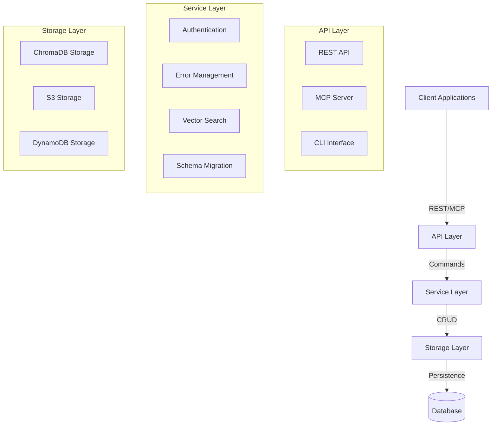

# System Patterns: Tribal

## Architecture Overview

Tribal follows a layered architecture with clean separation of concerns:

## Key Design Patterns

### Repository Pattern
- **Implementation**: `storage_interface.py` defines the storage interface
- **Concrete Implementations**: ChromaDB, S3, and DynamoDB
- **Purpose**: Abstracts data storage and retrieval, enabling multiple storage backends

### Dependency Injection
- **Implementation**: Services are instantiated and passed to API layer
- **Purpose**: Decouples components and facilitates testing

### Factory Pattern
- **Implementation**: Storage implementations are created based on configuration
- **Purpose**: Centralizes creation logic and simplifies runtime storage selection

### Adapter Pattern
- **Implementation**: MCP server adapts between MCP protocol and internal services
- **Purpose**: Provides a consistent interface to the underlying services

### Strategy Pattern
- **Implementation**: Different storage backends represent different strategies
- **Purpose**: Allows runtime selection of storage mechanisms without changing client code

## Component Relationships

### MCP Server → FastAPI Server
- MCP Server forwards requests to the FastAPI backend
- JSON-based communication over HTTP
- Authentication forwarded via headers

### API Layer → Service Layer
- API endpoints delegate business logic to service layer
- Services handle error tracking, validation, and storage operations
- Clean separation between HTTP/MCP concerns and business logic

### Service Layer → Storage Layer
- Services use storage interface to persist data
- Abstract interface allows interchangeable storage implementations
- Storage implementations handle database-specific operations

## Key Technical Decisions

### Vector Database: ChromaDB
- **Rationale**: Provides efficient vector similarity search for error matching
- **Alternative Considered**: PostgreSQL with pgvector, rejected due to additional complexity
- **Trade-offs**: Better search capabilities at the cost of using a specialized database

### Authentication: JWT Tokens
- **Rationale**: Stateless authentication that works well in distributed environments
- **Implementation**: Python-jose library with optional cryptography backend
- **Trade-offs**: Simplicity over more complex OAuth flows

### API Protocol: FastAPI
- **Rationale**: Modern, async-first framework with automatic OpenAPI documentation
- **Alternative Considered**: Flask, rejected due to lack of native async support
- **Trade-offs**: Better performance and documentation at cost of newer ecosystem

### MCP Integration: Native Protocol
- **Rationale**: Direct integration with Claude Code and other MCP clients
- **Implementation**: MCP SDK with custom tool implementations
- **Trade-offs**: Requires maintaining protocol compatibility

## Schema Management

### Version Compatibility
- Schema versions track database structure changes
- Compatibility matrix defines which application versions work with which schema versions
- Migration paths ensure database schema can evolve safely

### Error Record Schema
- Rich context capture for comprehensive error matching
- Embedded metadata for tracking schema versions
- Vector embeddings for semantic similarity search

## Error Handling Strategy
- Consistent error codes and messages across API endpoints
- Detailed error tracking with context preservation
- Graceful degradation when storage backends are unavailable

## Scalability Considerations
- Read-heavy workload optimized for fast lookups
- Stateless API design for horizontal scaling
- Storage abstraction allows migration to more scalable backends as needed
